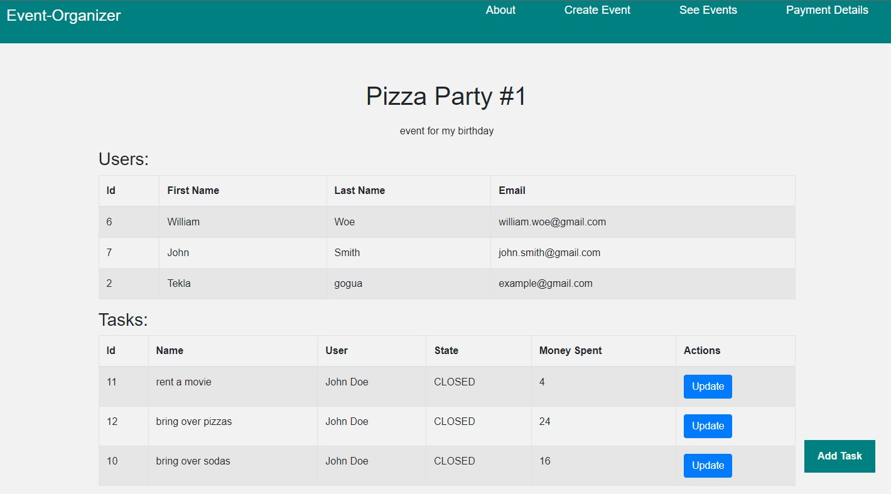

# Event Organizer Application

## Screenshot





## Features

### Registration And Login 
Users can create their account and login with their password and email

### Event Creation And Management
Users can create and manage events by providing details such as name and description,they can also see detailed page of their event.

### Adding Users To The Event
admin (creator of event) can add other users to the event by their id.

### Task Creation And Management
in event page users can see and create tasks. after creating tasks they can also update it and constantly track progress of its status (UNASSIGNED,IN_PROGRESS or CLOSED).

### Payment Details
users can see amount of money spent on each tasks and how much they should pay to whom.

## API Reference
You can run the application on http://localhost:8080/

#### Create Event

```http
  POST /home/create-event
```

| Parameter | Type     | Description                |
| :-------- | :------- | :------------------------- |
| `name` | `string` | **Required**. name of event |
| `description` | `string` | **Required**. description of event |

#### Get All Events

```http
  GET /home/see-all
```
displays all events

#### Add User To The Event

```http
  POST /home/invite-user
```

| Parameter | Type     | Description                |
| :-------- | :------- | :------------------------- |
| `userId` | `integer` | **Required**. id of user you want to add |
| `eventId` | `integer` | **Required**. id of event |


#### Get Event By Id

```http
  GET /event/{eventId}
```

| Parameter | Type     | Description                |
| :-------- | :------- | :------------------------- |
| `eventId` | `integer` | **Required**. id of event you want to get |


#### Create Task

```http
  POST /event/{eventId}/create-task
```

| Parameter | Type     | Description                |
| :-------- | :------- | :------------------------- |
| `eventId` | `integer` | **Required**. id of event |
| `name` | `string` | **Required**.  task name|
| `state` | `string` | **Required**. task state |

#### Update Task

```http
  POST /update-task
```

| Parameter | Type     | Description                |
| :-------- | :------- | :------------------------- |
| `taskId` | `integer` | **Required**. id of task |
| `name` | `string` | **Required**.  task name|
| `state` | `string` | **Required**. task state |
| `money` | `number` | **Required**. amount you spent|

#### Get Event By Id

```http
  GET /home/payment-details
```
displays who should pay to whom

## Built with

* Spring Boot
* Maven
* Spring Security
* Spring Data
* PostgreSQL
* Flyway
* Junit, Mockito
* Swagger
